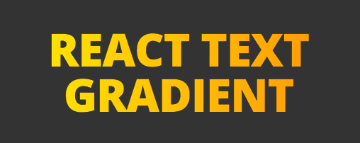

# [React Text Gradient](http://javierbyte.github.io/react-textgradient/)

A React component that creates text gradients with CSS, including a SVG fallback.

[Live demo](http://javierbyte.github.io/react-textgradient/)

# Features
* Uses CSS gradients when possible (Chrome, Safari, iOS, android).
* Uses SVG as fallback on Firefox.
* The text remains as fluid text (never replaced with svg).
* Font size, family, weight, etc... controlled by CSS as normal.

# Installation

    npm install react-textgradient --save

# Usage

First, require the component

    var TextGradient = require('react-textgradient');

And then use it like this:

    <TextGradient
        text='React Text Gradient'
        fromColor='#FFFF00'
        toColor='#FF8008'
        direction='right'
        />

 And you will get the example of the start of the page.

## Props

* `text`: The content.
* `fromColor`: The initial color for the gradient. Can be any valid color for CSS and SVG (HEX, RGBA, RGB, etc...).
* `toColor` The final color of the gradient.
* `fallbackColor`: The color to display on unsupported browsers. Optional, defaults to `toColor`.
* `direction`: One from 'top', 'left', 'bottom', 'right'. Optional, defaults to 'right'.